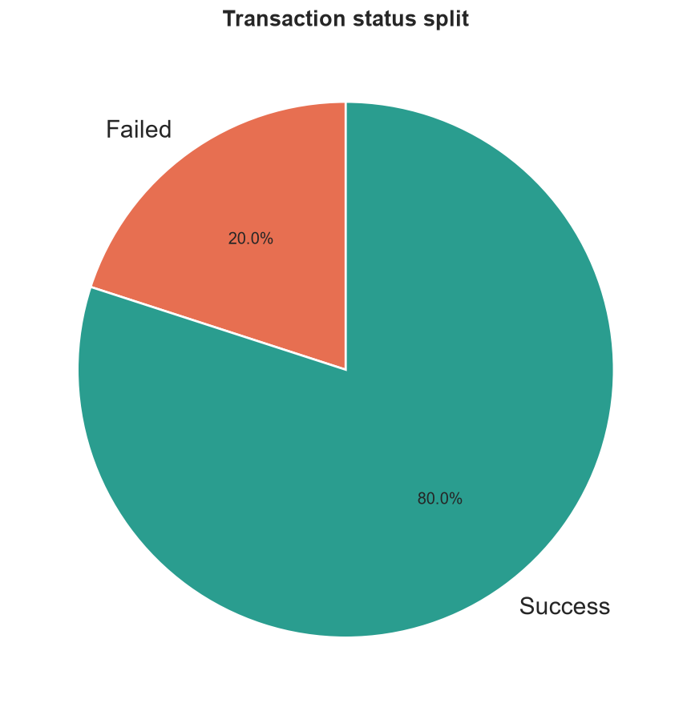
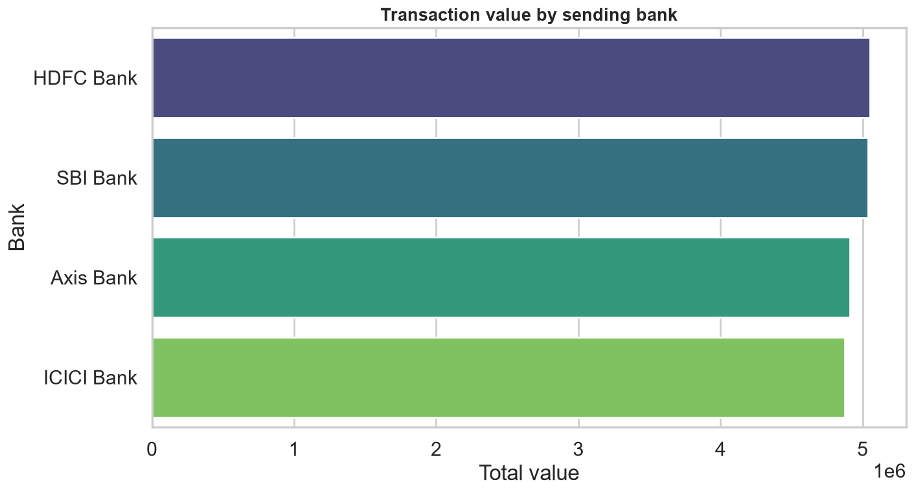
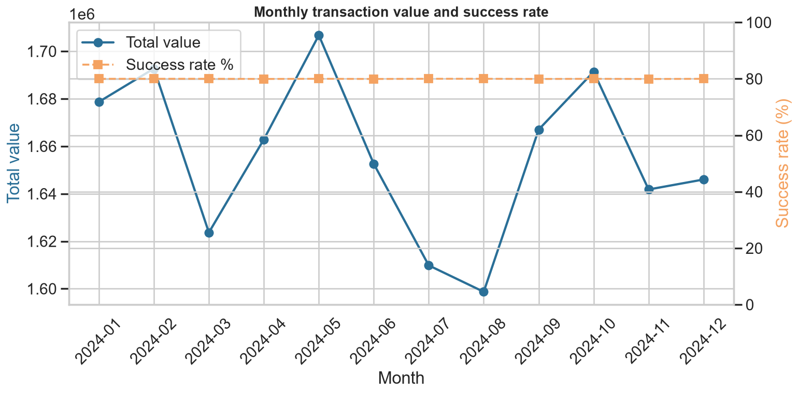
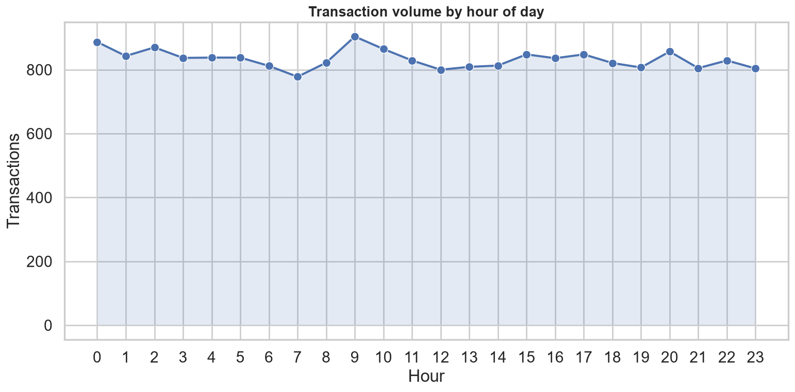
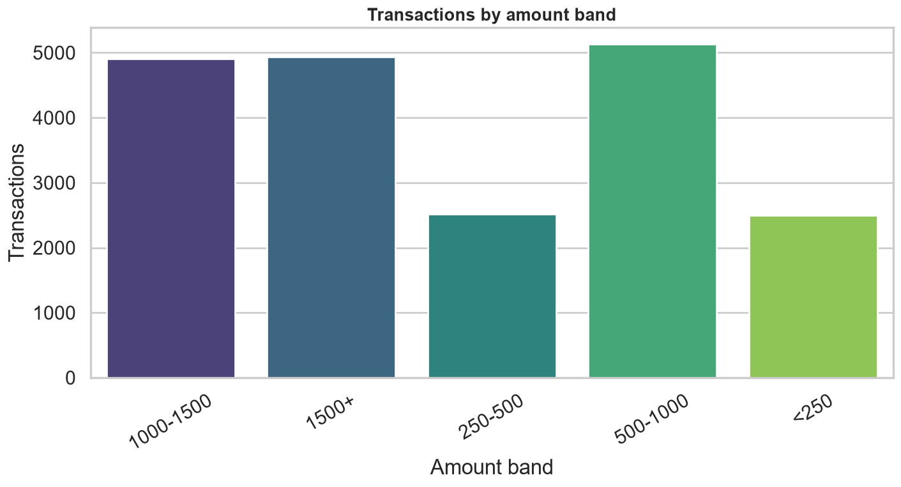
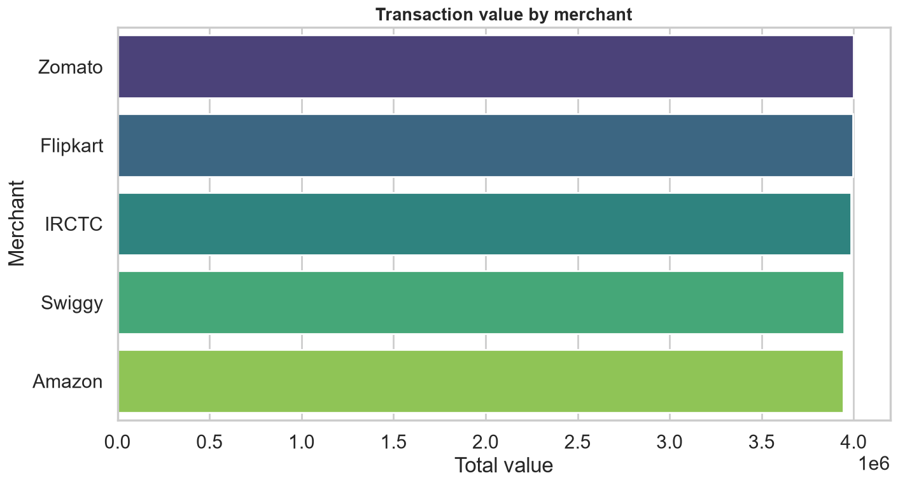

# 💳 UPI Transactions Data Analysis

[](https://github.com/panteamkhh/upi-transactions-data-analysis/actions/workflows/ci.yml)
[](LICENSE)
[](https://www.python.org/downloads/)
[](https://github.com/psf/black)
[](https://streamlit.io)

A 20,000-row UPI transactions dataset, analysed three ways: exploratively in
**Python**, packaged as an interactive **Streamlit** dashboard, and modelled as a
**Power BI** report — so a business user can explore it without touching code.

## Table of contents

- [Dataset](#dataset)
- [Part 1 — Exploring the data in Python](#part-1--exploring-the-data-in-python)
- [Part 2 — The interactive Streamlit dashboard](#part-2--the-interactive-streamlit-dashboard)
- [Part 3 — The Power BI report](#part-3--the-power-bi-report)
- [Key results](#key-results)
- [Data quality caveats](#data-quality-caveats)
- [Tech stack](#tech-stack)
- [Project structure](#project-structure)
- [Quick start](#quick-start)
- [Development](#development)
- [Key assumptions](#key-assumptions)
- [License](#license)

## Dataset

`data/raw/upi_transactions.xlsx` is a **synthetic sample** of 20,000 UPI
transactions dated across 2024. It is a single flat sheet with 20 columns.

| Aspect | Detail |
|--------|--------|
| Rows | 20,000 (one per transaction) |
| Columns | 20 — IDs, date/time, amount, banks, city, customer & merchant details |
| Period | 2024-01-01 → 2024-12-30 |
| Dimensions | 4 banks · 4 cities · 5 merchants · 5 purposes · 3 devices · 3 payment methods · 4 currencies |
| Amount range | 0.05 – 1,999.87 (mean ≈ 993.61) |
| Status | 80 % Successful · 20 % Failed |

> The data is fully synthetic. Account numbers, customer attributes and merchant
> activity are generated placeholders, not real people or businesses.

---

## Part 1 — Exploring the data in Python

The analysis started with one question and let each answer point to the next.
Every step is a function in [`src/`](src) — `analysis.py` returns the numbers,
`visualization.py` renders the chart — so the notebook re-runs end-to-end with
no manual steps.

**How much value flows through the network?** 20,000 transactions moved
**₹1.99 crore**, of which **₹1.59 crore settled** and **₹39.97 lakh failed**.



**Which banks and cities carry the volume?** Value is remarkably evenly split
across the four banks and four cities — each bank/city handles exactly 5,000
transactions.



**Is activity seasonal?** Monthly value stays within about ±4 % of the average
all year — there is **no meaningful seasonality** in this sample.



**When do people transact?** Volume peaks around **09:00** and is spread fairly
evenly across the day and week.



**Which amounts matter?** The two highest amount bands are ~14 % of transactions
but **74 % of total value** — a classic long-tail revenue profile.



**Which merchants and purposes dominate?** All five merchants process ~4,000
transactions each, and the five purposes have almost identical totals.



The full set of 16 charts lives in [`screenshots/`](screenshots) and the
question-by-question narrative is in
[`notebooks/UPI_Transactions_Analysis.ipynb`](notebooks/UPI_Transactions_Analysis.ipynb).

---

## Part 2 — The interactive Streamlit dashboard

The notebook answers each question once. The dashboard makes the same questions
**explorable**: filter by date, city, bank, merchant, device, payment method,
status or transaction type and every visual updates together.

```bash
streamlit run dashboard/app.py
```

**Six tabs**

| Tab | What it shows |
|-----|---------------|
| Overview | KPI cards, value by bank/city, status split, month-over-month table |
| Trends | Monthly value vs. success-rate combo, quarterly bars, hourly area, day-of-week |
| Banks & Cities | City treemap, success rate by city, sent-vs-received bank tables |
| Merchants & Purpose | Merchant/purpose rankings and detail tables |
| Customers & Devices | Age, gender, device, payment-method splits and amount histogram |
| Data Explorer | Every filtered row, with one-click CSV export |

A live status/date-range filter strip and cross-visual filtering match how the
Power BI report behaves.

> Want to see it without installing anything? The same aggregates are exported to
> `reports/summary.json` by the CLI.

---

## Part 3 — The Power BI report

The dashboard in Power BI reuses the **same star schema** the pipeline exports,
so its numbers match Python by construction.

```text
DimDate ─┐
DimBank ─┤
DimCity ─┼──►  FactTransactions  (20,000 rows)
DimMerchant ─┘
```

Everything needed to build it is in [`powerbi/`](powerbi):

- `FactTransactions.csv` + `DimDate.csv` + `DimBank.csv` + `DimCity.csv` +
  `DimMerchant.csv` — the exported star schema, written by `python -m src.run_analysis`.
- [`dax_measures.md`](powerbi/dax_measures.md) — 25 documented DAX measures
  (value, success rate, MoM/QoQ/YoY, running total, ranking).
- [`data_model.md`](powerbi/data_model.md) — ER diagram, relationships and the
  role-playing bank dimension.
- [`build_guide.md`](powerbi/build_guide.md) — a page-by-page recipe for the
  six report pages.
- `UPI_Theme.json` — the colour/typography theme used across the report.

> **Why no committed `.pbix`?** A `.pbix` is a binary VertiPaq archive that can't
> be diffed or generated as text. Exporting the model as CSV plus a documented
> DAX catalogue keeps the report fully reproducible from source — rebuild it with
> the guide in ~15 minutes, then hit **Refresh** whenever the pipeline reruns.

The model includes the full time-intelligence set (`DATEADD`, `SAMEPERIODLASTYEAR`,
`DATESINPERIOD`), a running total, merchant ranking, and a role-playing bank
dimension for sent-vs-received analysis.

---

## Key results

- **20,000 transactions**, total value **₹1,98,72,274**, average ticket **₹993.61**.
- **80.0 % success rate** — 16,000 settled, **4,000 failed (₹39,96,787 never settled)**.
- **High-value concentration:** the ₹1,000–1,500 and ₹1,500+ bands are ~14 % of
  transactions but **~74 % of value**.
- Volume is split evenly **50/50 transfer vs. payment**, and almost perfectly
  even across **device** (~33 % each) and **payment method** (~33 % each).
- **No monthly seasonality** (all months within ±4 % of the average).
- **Estimated platform revenue ₹71,290.75**, assuming a 0.9 % MDR on successful
  payments.
- Value is near-identical across banks, cities, merchants and purposes — the
  sample is deliberately balanced.

## Data quality caveats

This is synthetic data, and several columns are **near-perfectly confounded**.
Treat every correlation below as an artefact of how the sample was generated,
not a business insight:

- `BankNameSent` determines `TransactionType`: **SBI & Axis send only Transfers,
  HDFC & ICICI send only Payments** — so estimated revenue concentrates in just
  two banks.
- `MerchantName` maps 1:1 to `Purpose` (e.g. **Flipkart ↔ Shopping**).
- **Flipkart shows a 0 % success rate** (all 4,000 transactions failed), and
  `Gender` aligns with the bank/type split — both are spurious.
- `Status` swings with specific **calendar dates** (e.g. 01-Jan and 26-Feb are
  100 % failed) and **weekday** (Monday 50 % vs. Sunday 100 %).

These findings are surfaced deliberately: spotting confounding and data artefacts
is part of the analysis, and the pipeline/notebook make them easy to inspect.

## Tech stack

**Python** — pandas, numpy, matplotlib, seaborn, Jupyter
**Dashboard** — Streamlit, Plotly
**Power BI** — star schema, DAX time intelligence, slicers, drill-through
**Tooling** — pytest, ruff, black, GitHub Actions, pre-commit

## Project structure

```text
upi-transactions-data-analysis/
├── data/
│   ├── raw/upi_transactions.xlsx          # source workbook (20,000 rows)
│   └── processed/                         # cleaned + enriched CSV (generated)
├── dashboard/
│   └── app.py                             # interactive Streamlit dashboard
├── powerbi/
│   ├── FactTransactions.csv               # exported star schema (generated)
│   ├── DimDate.csv · DimBank.csv · DimCity.csv · DimMerchant.csv
│   ├── upi_transactions.csv               # flat denormalised export (generated)
│   ├── dax_measures.md                    # documented DAX measures
│   ├── data_model.md                      # star-schema diagram + relationships
│   ├── build_guide.md                     # page-by-page report build guide
│   ├── UPI_Theme.json                     # custom report theme
│   └── screenshots/                       # report screenshots
├── src/                                   # analysis package
│   ├── config.py                          # paths and business constants
│   ├── data_loader.py                     # reads + validates the workbook
│   ├── data_cleaning.py                   # whitespace / dtype cleanup
│   ├── feature_engineering.py             # date, segment & revenue features
│   ├── analysis.py                        # one function per business question
│   ├── visualization.py                   # matching chart for each question
│   ├── powerbi_export.py                  # builds the star schema CSVs
│   └── run_analysis.py                    # end-to-end CLI entry point
├── tests/                                 # pytest suite (36 tests)
├── notebooks/UPI_Transactions_Analysis.ipynb
├── screenshots/                           # chart images exported by the pipeline
├── reports/summary.json                   # machine-readable run report (generated)
├── .github/workflows/ci.yml               # lint + format + test CI
├── pyproject.toml                         # metadata, deps, tool config
├── requirements.txt                       # runtime dependencies
└── requirements-dev.txt                   # runtime + dev dependencies
```

## Quick start

```bash
git clone https://github.com/panteamkhh/upi-transactions-data-analysis.git
cd upi-transactions-data-analysis

python -m venv .venv
# Windows (PowerShell)
.\.venv\Scripts\Activate.ps1
# macOS / Linux
source .venv/bin/activate

pip install -r requirements.txt
```

Run the full analysis and regenerate every artefact (processed data, charts,
`reports/summary.json` and the Power BI CSVs):

```bash
python -m src.run_analysis
```

Launch the dashboard:

```bash
streamlit run dashboard/app.py
```

Or explore interactively:

```bash
pip install -r requirements-dev.txt
jupyter notebook notebooks/UPI_Transactions_Analysis.ipynb
```

## Development

```bash
pip install -e ".[dev]"     # or: pip install -r requirements-dev.txt

ruff check .                # lint
black --check .             # formatting
pytest                      # tests (36 passing)
pre-commit install          # optional git hooks
```

CI runs lint, format checks and the test suite on Python 3.10–3.12, then
smoke-tests the pipeline. See [`CONTRIBUTING.md`](CONTRIBUTING.md) for details.

## Key assumptions

- **Estimated revenue, not measured.** The source data has no fee or cost column,
  so platform revenue is modelled as a **0.9 % Merchant Discount Rate on
  successful `Payment` rows**. Transfers and failed transactions earn nothing.
  This mirrors how the Power BI model defines `Estimated Revenue`; change
  `MDR_RATE` in `src/config.py` to re-run every surface at a different rate.
- **Status is authoritative.** Success/failure comes straight from the `Status`
  column; nothing is inferred.
- **Amounts are single-currency.** The `Currency` column is treated as a label
  (no FX conversion is applied), so sums are only meaningful within a currency.
- **Age and amount bands** are fixed buckets defined in `src/config.py` and
  reused across the notebook, dashboard and Power BI model.
- The dataset is synthetic; see [Data quality caveats](#data-quality-caveats).

## License

Released under the [MIT License](LICENSE).
