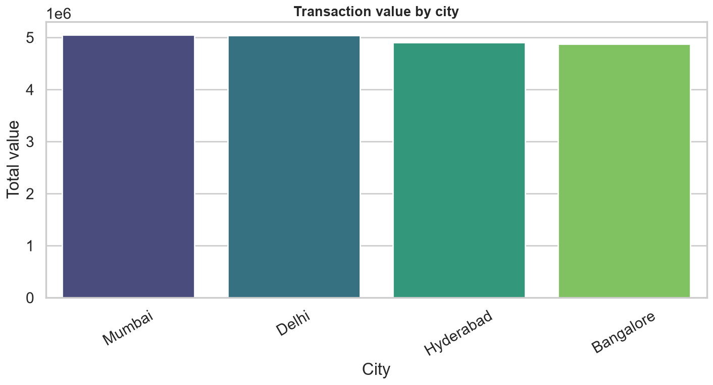
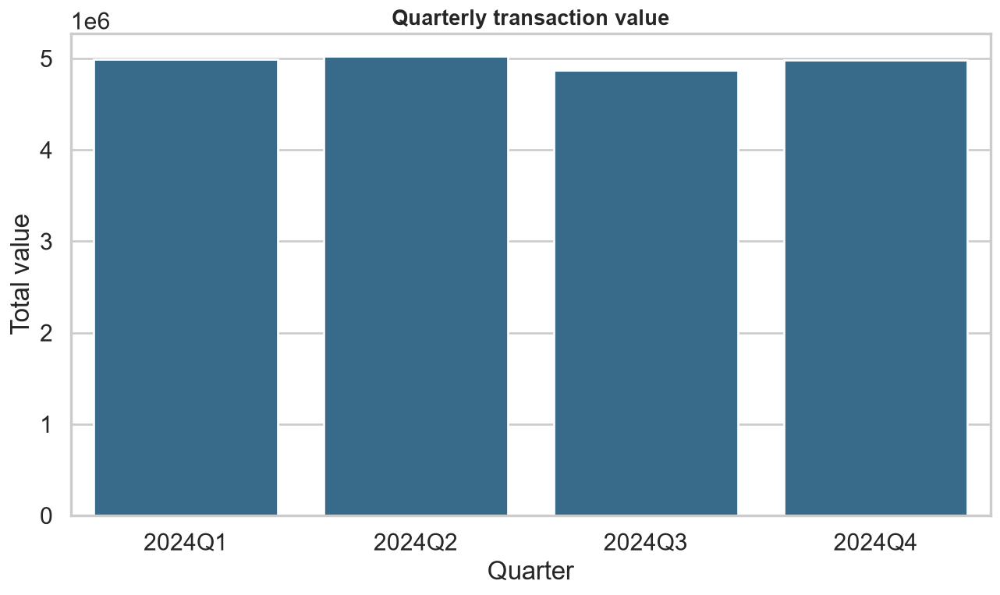
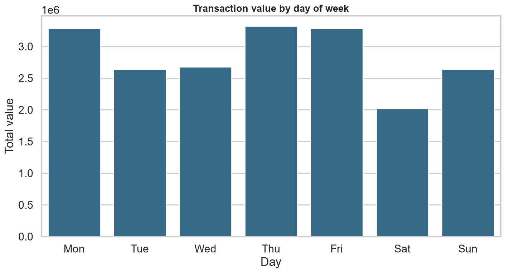
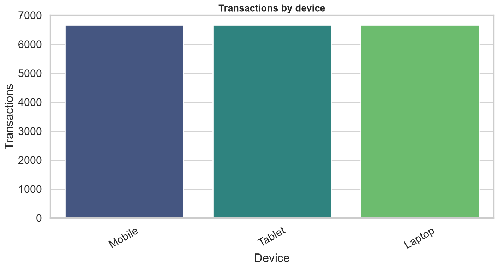
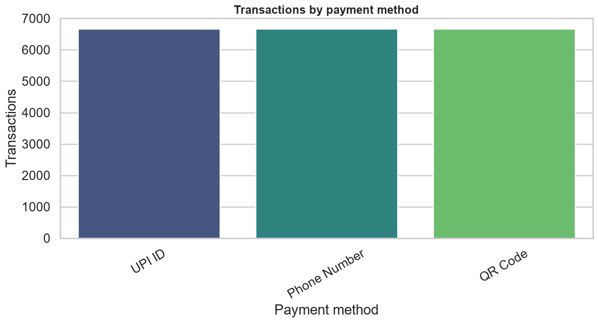
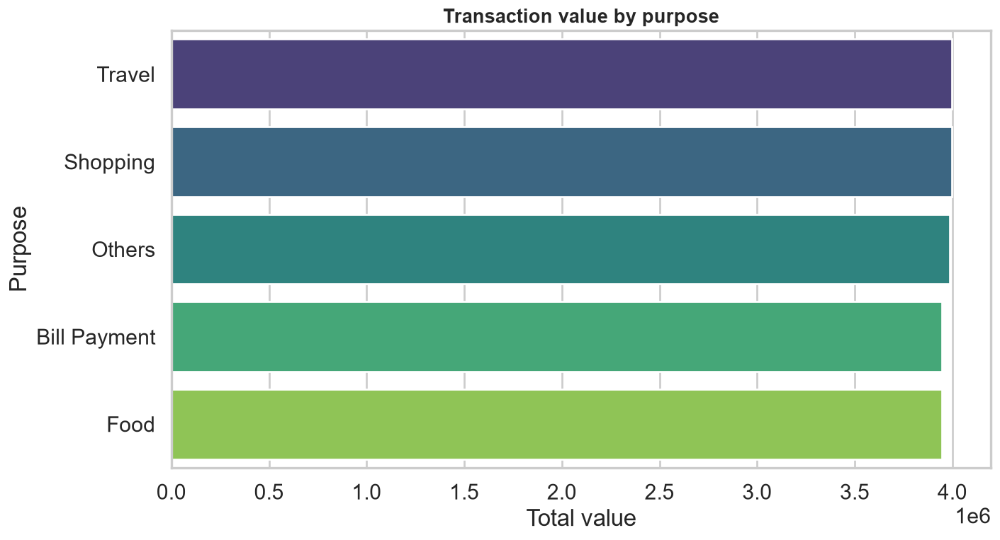
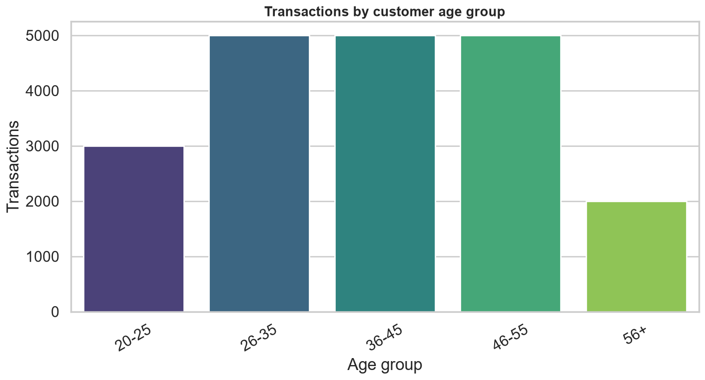
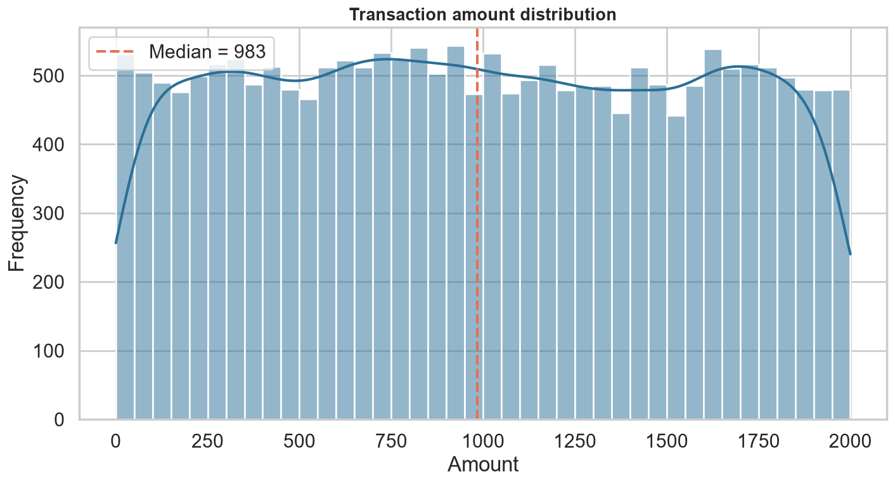
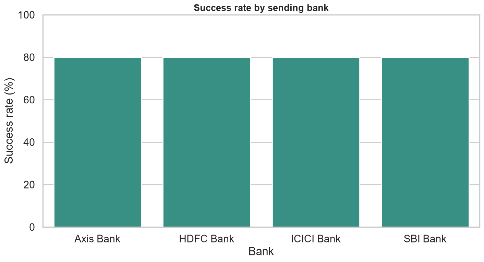
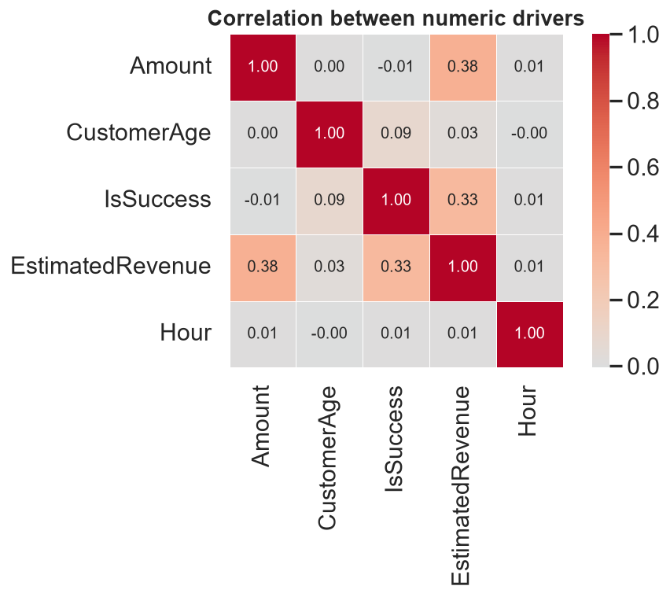

<div align="center">

# 💳 UPI Transactions Data Analysis

**An end-to-end analysis of 20,000 UPI transactions — Python pipeline · Streamlit dashboard · Power BI report.**

[](https://github.com/panteamkhh/upi-transactions-data-analysis/actions/workflows/ci.yml)
[](LICENSE)
[](https://www.python.org/downloads/)
[](https://github.com/psf/black)
[](tests)
[](https://streamlit.io)


<sub>Monthly value vs. success rate · overall status split</sub>

</div>

---

## Highlights

- 🔁 **One pipeline, three surfaces** — the notebook, the Streamlit dashboard and
  the Power BI model all read the same `src/` package, so the numbers never drift.
- 📊 **20 business-question aggregates** and **16 styled charts**, regenerated by a
  single command.
- 🖥️ **Interactive dashboard** with sidebar filters, KPI cards, six tabs and CSV
  export.
- 📈 **Power BI star schema** — fact + four dimensions, 25 documented DAX
  measures, an ER model and a page-by-page build guide.
- ✅ **59 passing tests**, `ruff` + `black`, and GitHub Actions CI on Python
  3.10–3.12.

## Table of contents

| Analysis | Delivery |
|----------|----------|
| [Dataset](#dataset) | [Tech Stack](#tech-stack) |
| [Part 1: Python Analysis](#part-1-python-analysis) | [Project Structure](#project-structure) |
| [Part 2: Streamlit Dashboard](#part-2-streamlit-dashboard) | [Quick Start](#quick-start) |
| [Part 3: Power BI Report](#part-3-power-bi-report) | [Development](#development) |
| [Key Results](#key-results) | [Key Assumptions](#key-assumptions) |
| [Data Quality Caveats](#data-quality-caveats) | [License](#license) |

---

## Dataset

`data/raw/upi_transactions.xlsx` is a **synthetic sample** of 20,000 UPI
transactions dated across 2024 — a single flat sheet with 20 columns.

| Aspect | Detail |
|:-------|:-------|
| Rows | 20,000 (one per transaction) |
| Columns | 20 — IDs, date/time, amount, banks, city, customer & merchant details |
| Period | 2024-01-01 → 2024-12-30 |
| Dimensions | 4 banks · 4 cities · 5 merchants · 5 purposes · 3 devices · 3 payment methods · 4 currencies |
| Amount | 0.05 – 1,999.87 (mean ≈ 993.61) |
| Status | 80% Successful · 20% Failed |

> ⚠️ **Synthetic data.** Account numbers, customer attributes and merchant
> activity are generated placeholders — not real people or businesses.

See the full column reference in [`docs/data_dictionary.md`](docs/data_dictionary.md).

---

## Part 1: Python Analysis

The analysis is question-driven: every step is a function in [`src/`](src) —
`analysis.py` returns the numbers, `visualization.py` renders the chart — so the
notebook re-runs end-to-end with no manual steps.

<table>
<tr>
<td width="50%"><b>How much value flows through the network?</b><br/>
20,000 transactions moved <b>₹1.99 crore</b>; <b>₹1.59 crore</b> settled and
<b>₹39.97 lakh</b> failed.</td>
<td width="50%"><b>Which banks carry the volume?</b><br/>
Value is evenly split across the four banks — each handles exactly 5,000
transactions.</td>
</tr>
<tr>
<td></td>
<td></td>
</tr>
<tr>
<td><b>Is activity seasonal?</b><br/>
Monthly value stays within ±4% of the average all year — <b>no meaningful
seasonality</b>.</td>
<td><b>When do people transact?</b><br/>
Volume peaks around <b>09:00</b> and is spread fairly evenly across the day.</td>
</tr>
<tr>
<td></td>
<td></td>
</tr>
<tr>
<td><b>Which amounts matter?</b><br/>
The two highest amount bands are ~14% of transactions but <b>74% of value</b>.</td>
<td><b>Which merchants dominate?</b><br/>
All five merchants process ~4,000 transactions each — a deliberately balanced sample.</td>
</tr>
<tr>
<td></td>
<td></td>
</tr>
</table>

<details>
<summary><b>Show all 16 charts</b></summary>
<br/>

| | |
|:--:|:--:|
|  |  |
|  |  |
|  |  |
|  |  |
|  | |

</details>

The full question-by-question narrative is in
[`notebooks/UPI_Transactions_Analysis.ipynb`](notebooks/UPI_Transactions_Analysis.ipynb).

---

## Part 2: Streamlit Dashboard

The notebook answers each question once. The dashboard makes the same questions
**explorable** — filter by date, city, bank, merchant, device, payment method,
status or transaction type and every visual updates together.

```bash
streamlit run dashboard/app.py
```

| Tab | What it shows |
|:----|:--------------|
| **Overview** | KPI cards, value by bank/city, status split, month-over-month table |
| **Trends** | Monthly value vs. success-rate combo, quarterly bars, hourly area, day-of-week |
| **Banks & Cities** | City treemap, success rate by city, sent-vs-received bank tables |
| **Merchants & Purpose** | Merchant/purpose rankings and detail tables |
| **Customers & Devices** | Age, gender, device, payment-method splits and amount histogram |
| **Data Explorer** | Every filtered row, with one-click CSV export |

> The same aggregates are written to `reports/summary.json` by the CLI, so results
> are available without launching anything.

---

## Part 3: Power BI Report

The Power BI report reuses the **same star schema** the pipeline exports, so its
numbers match Python by construction.

```text
DimDate ─┐
DimBank ─┤
DimCity ─┼──►  FactTransactions  (20,000 rows)
DimMerchant ─┘
```

Everything needed to build it is in [`powerbi/`](powerbi):

| Asset | Purpose |
|:------|:--------|
| `FactTransactions.csv` + `Dim*.csv` | Exported star schema, written by `python -m src.run_analysis` |
| [`dax_measures.md`](powerbi/dax_measures.md) | 25 documented DAX measures (value, success rate, MoM/QoQ/YoY, running total, ranking) |
| [`data_model.md`](powerbi/data_model.md) | ER diagram, relationships and the role-playing bank dimension |
| [`build_guide.md`](powerbi/build_guide.md) | Page-by-page recipe for the six report pages |
| `UPI_Theme.json` | Colour/typography theme used across the report |

> **Why no committed `.pbix`?** A `.pbix` is a binary VertiPaq archive that can't
> be diffed or generated as text. Exporting the model as CSV plus documented DAX
> keeps the report reproducible — rebuild it with the guide in ~15 minutes, then
> hit **Refresh** whenever the pipeline reruns.

---

## Key Results

| Metric | Value |
|:-------|------:|
| Transactions | **20,000** |
| Total value | **₹1,98,72,274** |
| Average ticket | **₹993.61** |
| Success rate | **80.0%** (16,000 settled · 4,000 failed) |
| Failed value | **₹39,96,787** |
| Estimated revenue | **₹71,290.75** (0.9% MDR on successful payments) |

- **High-value concentration:** the ₹1,000–1,500 and ₹1,500+ bands are ~14% of
  transactions but **~74% of value**.
- Volume splits **50/50 transfer vs. payment**, and almost perfectly evenly
  across **device** (~33% each) and **payment method** (~33% each).
- **No monthly seasonality** — all months fall within ±4% of the average.
- Value is near-identical across banks, cities, merchants and purposes.

---

## Data Quality Caveats

This is synthetic data, and several columns are **near-perfectly confounded**.
Treat every correlation below as an artefact of how the sample was generated, not
a business insight:

- `BankNameSent` determines `TransactionType`: **SBI & Axis send only Transfers,
  HDFC & ICICI send only Payments** — so estimated revenue concentrates in two banks.
- `MerchantName` maps 1:1 to `Purpose` (e.g. **Flipkart ↔ Shopping**).
- **Flipkart shows a 0% success rate** (all 4,000 transactions failed), and
  `Gender` aligns with the bank/type split — both spurious.
- `Status` swings with specific **calendar dates** (e.g. 01-Jan and 26-Feb are
  100% failed) and **weekday** (Monday 50% vs. Sunday 100%).

Spotting confounding and data artefacts is part of the analysis — the pipeline and
notebook make them easy to inspect.

---

## Tech Stack

| Layer | Tools |
|:------|:------|
| **Analysis** | pandas · numpy · matplotlib · seaborn · Jupyter |
| **Dashboard** | Streamlit · Plotly |
| **Power BI** | star schema · DAX time intelligence · slicers · drill-through |
| **Quality** | pytest · ruff · black · pre-commit · GitHub Actions |

---

## Project Structure

```text
upi-transactions-data-analysis/
├── data/
│   ├── raw/upi_transactions.xlsx          # source workbook (20,000 rows)
│   └── processed/                         # cleaned + enriched CSV (generated)
├── dashboard/
│   ├── app.py                             # interactive Streamlit dashboard
│   └── README.md
├── docs/
│   ├── architecture.md                    # pipeline & module contracts
│   └── data_dictionary.md                 # every column explained
├── powerbi/
│   ├── FactTransactions.csv               # exported star schema (generated)
│   ├── DimDate.csv · DimBank.csv · DimCity.csv · DimMerchant.csv
│   ├── dax_measures.md · measures.dax     # documented DAX
│   ├── data_model.md · build_guide.md     # model + page-by-page guide
│   ├── UPI_Theme.json                     # custom report theme
│   └── screenshots/
├── src/                                   # analysis package
│   ├── config.py                          # paths and business constants
│   ├── data_loader.py                     # reads + validates the workbook
│   ├── data_cleaning.py                   # whitespace / dtype cleanup
│   ├── feature_engineering.py             # date, segment & revenue features
│   ├── analysis.py                        # one function per business question
│   ├── visualization.py                   # matching chart for each question
│   ├── powerbi_export.py                  # builds the star schema CSVs
│   ├── run_analysis.py                    # end-to-end CLI entry point
│   └── __main__.py                        # `python -m src`
├── tests/                                 # pytest suite (59 tests)
├── notebooks/UPI_Transactions_Analysis.ipynb
├── screenshots/                           # 16 chart images
├── reports/summary.json                   # machine-readable run report (generated)
├── .github/workflows/ci.yml               # lint + format + test CI
├── pyproject.toml · requirements*.txt
└── Makefile
```

---

## Quick Start

```bash
git clone https://github.com/panteamkhh/upi-transactions-data-analysis.git
cd upi-transactions-data-analysis

python -m venv .venv
# Windows (PowerShell)
.\.venv\Scripts\Activate.ps1
# macOS / Linux
source .venv/bin/activate

pip install -r requirements.txt
```

Run the full analysis and regenerate every artefact — processed data, charts,
`reports/summary.json` and the Power BI CSVs:

```bash
python -m src.run_analysis
```

Launch the dashboard:

```bash
streamlit run dashboard/app.py
```

Or explore interactively:

```bash
pip install -r requirements-dev.txt
jupyter notebook notebooks/UPI_Transactions_Analysis.ipynb
```

---

## Development

```bash
pip install -e ".[dev]"     # or: pip install -r requirements-dev.txt

ruff check .                # lint
black --check .             # formatting
pytest                      # tests (59 passing)
pre-commit install          # optional git hooks
```

CI runs lint, format checks and the test suite on Python 3.10–3.12, then
smoke-tests the pipeline. See [`CONTRIBUTING.md`](CONTRIBUTING.md) for details.

---

## Key Assumptions

- **Estimated revenue, not measured.** The source has no fee or cost column, so
  platform revenue is modelled as a **0.9% Merchant Discount Rate on successful
  `Payment` rows**. Transfers and failures earn nothing. Change `MDR_RATE` in
  `src/config.py` to re-run every surface at a different rate.
- **Status is authoritative.** Success/failure comes straight from the `Status`
  column; nothing is inferred.
- **Amounts are single-currency.** The `Currency` column is a label only (no FX
  conversion), so sums are meaningful within a currency.
- **Fixed buckets.** Age and amount bands live in `src/config.py` and are reused
  across the notebook, dashboard and Power BI model.
- The dataset is synthetic — see [Data Quality Caveats](#data-quality-caveats).

---

## License

Released under the [MIT License](LICENSE).

<div align="center">
<sub>Built with 🐍 Python and 📊 Power BI · ⭐ star the repo if it helped you</sub>
</div>
