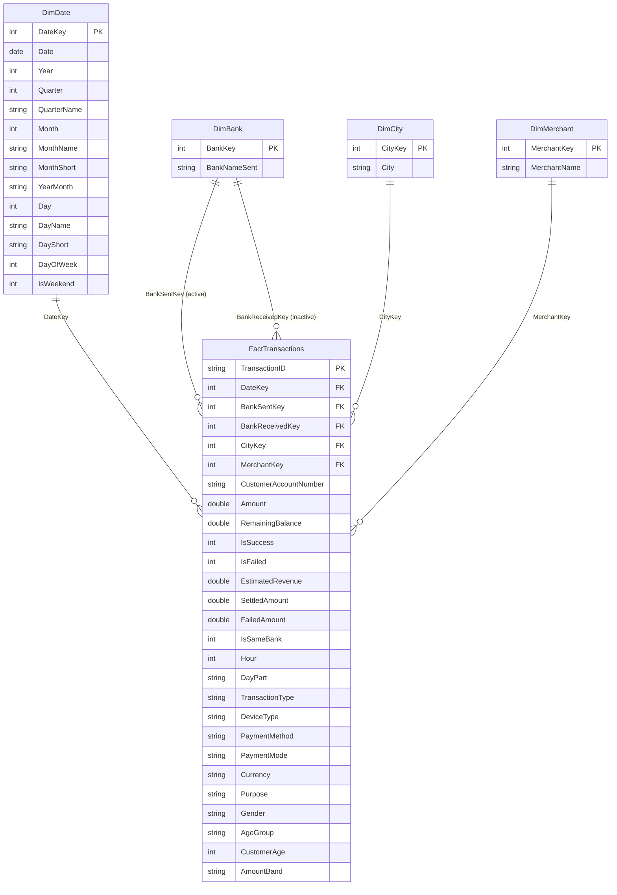

# Data model (star schema)

The report uses a classic star schema: one transaction fact table surrounded by
conformed dimensions. `src/powerbi_export.py` writes these exact tables to CSV,
so re-running `python -m src.run_analysis` keeps the model in sync.



## Relationship settings

| From | To | Cardinality | Cross-filter | Active |
|------|----|-------------|--------------|--------|
| `DimDate[DateKey]` | `FactTransactions[DateKey]` | 1 → * | Single | Yes |
| `DimBank[BankKey]` | `FactTransactions[BankSentKey]` | 1 → * | Single | Yes |
| `DimBank[BankKey]` | `FactTransactions[BankReceivedKey]` | 1 → * | Single | **No** |
| `DimCity[CityKey]` | `FactTransactions[CityKey]` | 1 → * | Single | Yes |
| `DimMerchant[MerchantKey]` | `FactTransactions[MerchantKey]` | 1 → * | Single | Yes |

The two relationships to `DimBank` are a **role-playing dimension**. To analyse
the receiving bank, add a second copy of `DimBank` (Model view → right-click →
*Duplicate*) or call `USERELATIONSHIP`:

```dax
Received Value =
CALCULATE ( [Total Value], USERELATIONSHIP ( FactTransactions[BankReceivedKey], DimBank[BankKey] ) )
```

## Design notes

- **Grain.** One row per transaction (`TransactionID` is unique).
- **Keys.** `DimBank`, `DimCity` and `DimMerchant` use surrogate integer keys so
  renaming a member never breaks the model. `DimDate` uses a smart `YYYYMMDD`
  integer key, which sorts correctly and hides the timestamp.
- **Additive measures.** `Amount`, `SettledAmount`, `FailedAmount` and
  `EstimatedRevenue` are fully additive. `Success Rate %` and `Average
  Transaction Value` are measures, never columns.
- **Estimated revenue.** `EstimatedRevenue = Amount × 0.9 %` for successful
  `Payment` rows, `0` for transfers and failures — see the assumptions section
  of the main README.
- **Degenerate dimensions** (`TransactionID`, `CustomerAccountNumber`,
  `DeviceType`, `PaymentMethod`, …) stay on the fact table: they are narrow and
  query fast, and adding a dimension per attribute would bloat the model.
